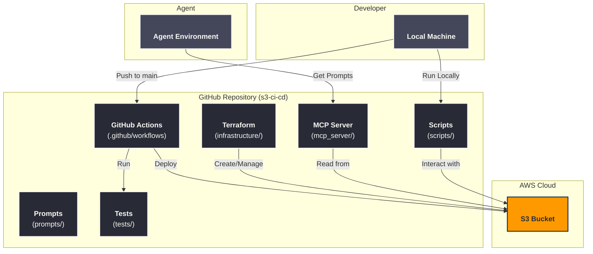

# S3 CI/CD for Agent Prompts

A complete learning project demonstrating how to build a robust CI/CD pipeline for managing AI agent prompts using AWS S3, GitHub Actions, and FastMCP.

## Project Overview

This project implements a versioned storage system for prompts where:
1.  **Prompts are Code**: Prompts are stored in this Git repository.
2.  **Automated Deployment**: GitHub Actions uploads changes to S3 automatically.
3.  **Versioning**: S3 Versioning ensures every change is saved and reversible.
4.  **MCP Server**: A FastMCP server (`s3-prompts`) serves prompts to agents.

## Architecture



## Getting Started

### Prerequisites
- Python 3.13+
- AWS Account
- GitHub Account

### 1. Setup Environment
Copy the example environment file and fill in your AWS credentials:
```bash
cp .env.example .env
```

### 2. Install Dependencies
```bash
pip install -e .
```

### 3. Create Infrastructure
This project includes Terraform configuration to simplify S3 setup.
```bash
cd infrastructure
terraform init
terraform apply -var="bucket_name=your-unique-bucket-name"
```
*Note: Make sure to update your `.env` file with the created bucket name.*

### 4. Run MCP Server
Start the FastMCP server to serve prompts locally:
```bash
fastmcp run mcp_server/main.py
```
Or use the inspector to test tools:
```bash
fastmcp inspect mcp_server/main.py
```

## Usage

### Managing Prompts
Prompts are located in the `prompts/` directory.
- **Edit**: Modify files in `prompts/`
- **Deploy**: Push to `main` branch to auto-deploy to S3.
- **Manual Upload**: `python scripts/upload_prompts.py`

### Version Control & Rollback
To list all versions of a prompt:
```bash
python scripts/list_versions.py prompts/agent/system.txt
```

To rollback to a previous version:
```bash
python scripts/rollback.py prompts/agent/system.txt <VERSION_ID>
```

## CI/CD Workflow

### Deployment (`deploy.yml`)
- Triggers on push to `main` branch.
- Checks out code.
- Configures AWS credentials.
- Uploads changed prompts to S3.

### Validation (`validate.yml`)
- Triggers on Pull Requests.
- Runs `pytest` to validate JSON syntax and prompt structure.

## Structure
```
s3-ci-cd/
├── .github/workflows/  # CI/CD Pipelines
├── infrastructure/     # Terraform for AWS S3
├── mcp_server/         # FastMCP Server Code
├── prompts/            # Prompt Files
├── scripts/            # Python Utilities for S3
├── tests/              # Validation Tests
└── main.py             # CLI Entry Point
```